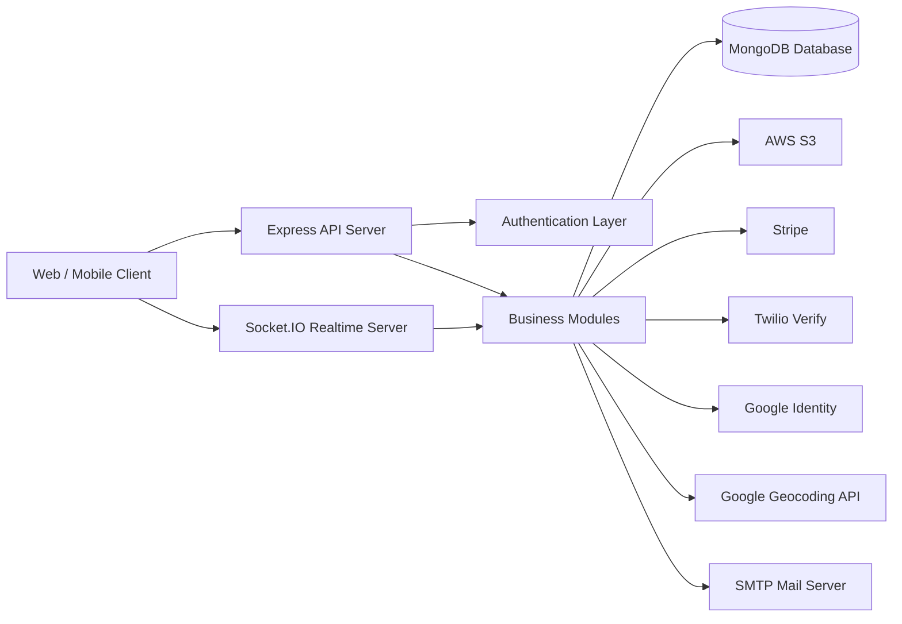
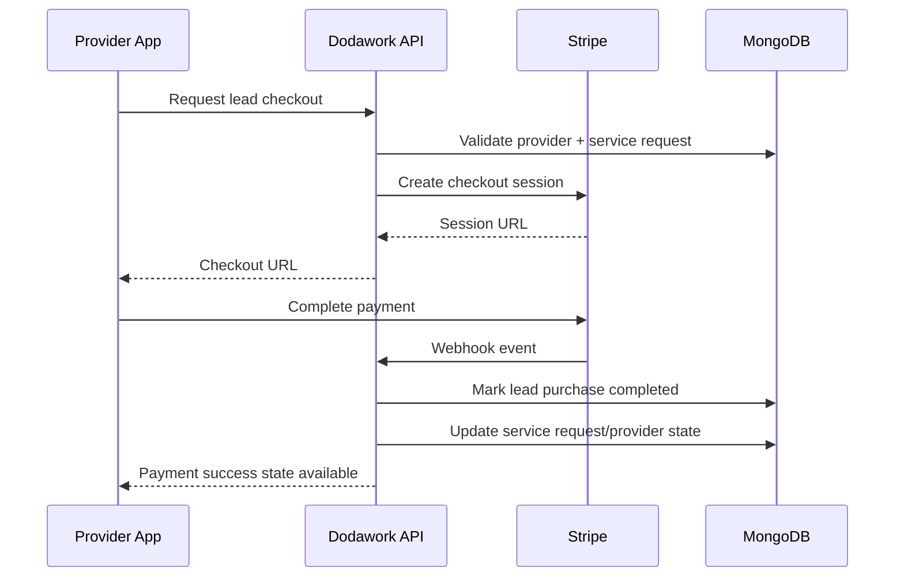
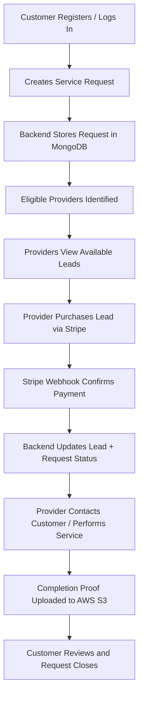

# Dodawork Backend Technical Documentation

## 1. Document Purpose

This document provides a client-friendly technical overview of the current Dodawork backend project. It explains:

- The technology stack
- Development and runtime environment
- Database and data layer
- AWS and third-party integrations
- Authentication and security approach
- Realtime communication
- Background processing
- High-level system architecture

The documentation is based on the current codebase in this repository and reflects the implementation that is actively present in code.

---

## 2. Executive Summary

Dodawork is a backend platform for a service marketplace where customers can create service requests, providers can discover and purchase leads, and admins can manage the workflow. The backend is implemented as a Node.js API server with realtime capabilities, file storage, payment processing, OTP verification, Google login, and email-based account flows.

At a high level, the backend provides:

- REST APIs for web and mobile clients
- JWT-based authentication and role-based access
- MongoDB data persistence
- Socket.IO-powered realtime chat and events
- AWS S3-based file storage
- Stripe payment checkout and webhook processing
- Twilio phone verification
- Google login and reverse geocoding support
- SMTP email delivery for account and verification workflows
- Cron jobs for automated housekeeping

---

## 3. High-Level Architecture

### Core Internal Layers

- **API Layer**: Handles HTTP requests through Express routes and controllers.
- **Business Layer**: Implements domain logic such as auth, service requests, lead purchase, provider flows, notifications, and chat.
- **Data Layer**: Stores structured data in MongoDB using Mongoose models.
- **Integration Layer**: Communicates with external systems such as Stripe, Twilio, AWS S3, Google, and SMTP.
- **Realtime Layer**: Uses Socket.IO for chat and live event delivery.

---

## 4. Programming Language and Backend Framework

### 4.1 Node.js

The backend runs on **Node.js** and uses a modern JavaScript runtime style that includes built-in `fetch()` support. Based on the codebase, Node.js 18+ is the practical runtime target.

### 4.2 JavaScript

The project is written in **JavaScript** and uses the **CommonJS** module format.

### 4.3 Express.js

The API server is built with **Express.js** and serves as the main HTTP application framework.

**Why it is used here**

- To expose REST API endpoints
- To organize route modules by business domain
- To attach middleware for parsing, cookies, CORS, authentication, uploads, and error handling

**Where it is implemented**

- `src/app.js`
- `src/app/routes/index.js`
- Route modules under `src/app/module/**`

### 4.4 EJS

The project uses **EJS** as a lightweight server-side view engine for payment result pages.

**Why it is used here**

- To render Stripe payment success/cancel pages after checkout

**Where it is implemented**

- `src/app.js`
- `src/views/payment_success.ejs`
- `src/views/payment_cancel.ejs`
- `src/app/module/payment/payment.routes.js`

---

## 5. Development and Runtime Environment

### 5.1 Local Development Setup

The current project is configured for standard Node.js development with environment variables loaded from `.env`.

**Commands**

- `npm install` installs dependencies
- `npm run dev` starts the application with Nodemon
- `npm start` starts the production-style server

### 5.2 Development Tooling

- **Nodemon** is used for auto-reloading during development
- **dotenv** is used to load environment variables

### 5.3 Current Environment Style

The repository currently shows:

- Environment-driven configuration
- No Dockerfile in the current repository
- No CI/CD configuration visible in the current repository
- A traditional Node server deployment model

### 5.4 Configuration Layer

Central configuration is handled through:

- `src/config/index.js`

This file gathers environment variables for:

- App runtime
- JWT
- Database connection
- Google login
- SMTP
- Stripe
- Miscellaneous application variables

---

## 6. API and Module Structure

The project follows a modular backend structure. Each major business area has its own route, controller, service, and often model files.

### Main functional modules

- Authentication
- Admin
- Super Admin
- User
- Provider
- Service Request
- Lead Purchase
- Chat
- Notification
- Review
- Category
- Content/Management pages
- Email Verification
- Phone Verification
- Payment/Webhook handling

### Route registration

All major modules are registered centrally in:

- `src/app/routes/index.js`

This approach keeps the API maintainable and scalable as the application grows.

---

## 7. Database Technology

### 7.1 MongoDB

The primary database is **MongoDB**.

**Why it is used here**

- Flexible schema support for rapidly evolving marketplace features
- Good fit for nested structures such as provider states, purchased lead references, and chat metadata
- Strong ecosystem support for Node.js applications

### 7.2 Mongoose

The backend uses **Mongoose** as the Object Data Modeling (ODM) library.

**Why it is used here**

- Defines schemas and models for all business entities
- Provides validation and relationship handling
- Supports middleware, indexes, and transactions

**Where it is implemented**

- `src/connection/connectDB.js`
- Model files under `src/app/module/**`

### 7.3 Database Connection

Database connection is initialized during server startup.

**Where it is implemented**

- `src/server.js`
- `src/connection/connectDB.js`

### 7.4 Main Data Entities

The current codebase contains models for:

- Auth
- User
- Provider
- Admin
- SuperAdmin
- ServiceRequest
- LeadPurchase
- Category
- Review
- Notification
- AdminNotification
- Conversation
- ConversationMessage
- Manage content sections

These models support user identity, service marketplace operations, provider acquisition flows, chat, notifications, reviews, and administrative content.

---

## 8. Authentication and Authorization

### 8.1 JWT Authentication

The project uses **JSON Web Tokens (JWT)** for authentication.

**Why it is used here**

- Stateless authentication for mobile/web clients
- Easy role-aware access control
- Suitable for API-driven architecture

**Implementation**

- Access tokens are issued for authenticated users
- Refresh tokens are also generated for longer session continuity
- Protected routes use middleware to validate token and role

**Where it is implemented**

- `src/util/jwtHelpers.js`
- `src/app/middleware/auth.js`
- `src/app/module/auth/auth.service.js`
- `src/app/module/emailVerification/emailVerification.service.js`
- `src/app/module/phoneVerification/phoneVerification.service.js`

### 8.2 Password Security

The system uses **bcrypt** for password hashing.

**Why it is used here**

- Prevents storing plaintext passwords
- Industry-standard hashing for user credentials

**Where it is implemented**

- `src/app/module/auth/Auth.js`
- `src/app/module/auth/auth.service.js`

### 8.3 Role-Based Access Control

The backend supports multiple user roles:

- User
- Provider
- Admin
- Super Admin

Role permissions are centralized in config and enforced by middleware.

**Where it is implemented**

- `src/config/index.js`
- `src/app/middleware/auth.js`

### 8.4 Google Login

The backend supports **Google Sign-In** using Google ID token verification.

**Why it is used here**

- Faster user onboarding
- Lower friction for login and registration
- Support for both User and Provider account creation flows

**How it is implemented**

1. Client sends Google ID token
2. Backend verifies token using Google Auth Library
3. Backend finds or creates the related account
4. Backend issues JWT tokens

**Where it is implemented**

- `src/app/module/auth/auth.routes.js`
- `src/app/module/auth/auth.service.js`

### 8.5 Phone-Based Authentication

The backend supports phone registration/login flows using **Twilio Verify**.

**Why it is used here**

- Supports OTP-based onboarding
- Useful for users who prefer phone-first authentication
- Helpful in service-marketplace scenarios where phone identity matters

**How it is implemented**

1. Client sends phone number
2. Backend requests Twilio Verify to send SMS OTP
3. Client submits OTP
4. Backend verifies OTP through Twilio
5. Backend activates or authenticates the account and returns JWT tokens

**Where it is implemented**

- `src/app/module/phoneVerification/phoneVerification.routes.js`
- `src/app/module/phoneVerification/phoneVerification.service.js`

---

## 9. Realtime Communication

### 9.1 Socket.IO

The project uses **Socket.IO** for realtime communication.

**Why it is used here**

- Realtime chat between users and providers
- Live event propagation
- Better user experience for active conversations and updates

**How it is implemented**

- HTTP server is wrapped with Socket.IO
- Socket events are registered through a central controller
- The same backend serves both REST and realtime layers

**Where it is implemented**

- `src/connection/socket.js`
- `src/socket/socket.controller.js`
- `src/connection/socketCors.js`

### 9.2 WebSocket Support

The project also includes the `ws` package and Socket.IO client dependency, although Socket.IO is the primary realtime implementation visible in the app server.

---

## 10. AWS Services

### 10.1 AWS S3

The backend actively uses **Amazon S3** for file storage.

**Why it is used here**

- Store user profile images
- Store service request attachments
- Store provider licenses and certificates
- Store completion proof media
- Store chat-uploaded files

**Implementation approach**

- `multer` handles multipart upload parsing
- `multer-s3` streams files directly to S3
- AWS SDK v3 is used for upload/delete operations

**Where it is implemented**

- `src/util/s3.util.js`
- `src/app/middleware/fileUploader.js`

### 10.2 AWS Services Not Currently Active in Code

The current repository does not show active implementation for:

- SES
- SNS
- SQS
- Lambda
- DynamoDB

Only **S3** is actively used in the current codebase.

---

## 11. Payments

### 11.1 Stripe

The backend uses **Stripe** for payment processing, specifically for provider lead purchase flows.

**Why it is used here**

- Secure hosted checkout page
- Reliable card payment processing
- Webhook-driven payment confirmation

### 11.2 What Stripe Handles in This Project

- Create checkout sessions for lead purchases
- Accept card payments
- Confirm completed payment through webhook events
- Update provider/service request state after successful purchase

### 11.3 How Stripe Is Implemented

1. Provider selects a service lead
2. Backend calculates price based on category
3. Backend creates a Stripe Checkout Session
4. Provider pays on Stripe-hosted page
5. Stripe sends webhook event to backend
6. Backend marks purchase completed
7. Backend unlocks or updates request/provider purchase state

**Where it is implemented**

- `src/app/module/lead/lead.service.js`
- `src/app/module/webhook/stripe.controller.js`
- `src/app/module/webhook/stripe.routes.js`
- `src/app/module/payment/payment.routes.js`

### 11.4 Payment Flow Diagram

---

## 12. Phone Verification and SMS

### 12.1 Twilio Verify API

The backend uses **Twilio Verify** for OTP SMS verification.

**Why it is used here**

- Managed OTP generation and expiration
- SMS delivery infrastructure
- Reduced complexity compared to self-managing OTP lifecycles

### 12.2 How It Is Used

- Send verification code to phone number
- Verify submitted OTP code
- Support phone-only registration
- Support phone login and resend flow

### 12.3 Implementation Notes

- E.164 phone number validation is performed in the backend
- There is also an in-memory rate limiting mechanism for repeated OTP requests
- On successful verification, the backend issues JWT access and refresh tokens

**Where it is implemented**

- `src/app/module/phoneVerification/phoneVerification.service.js`
- `src/app/module/phoneVerification/phoneVerification.routes.js`

---

## 13. Email Delivery

### 13.1 Nodemailer

The project uses **Nodemailer** for email delivery.

**Why it is used here**

- Account activation emails
- OTP/resend emails
- Password reset emails
- Additional account/admin communication templates

### 13.2 SMTP Transport

The implementation supports SMTP configuration through environment variables. It can work with a provider such as Gmail SMTP or a dedicated mail service.

### 13.3 Email Template Layer

The system includes template helpers for:

- Activation email
- OTP resend
- Password reset
- Email OTP
- Admin account creation
- Subscription-related notices

**Where it is implemented**

- `src/util/sendEmail.js`
- `src/util/emailHelpers.js`
- `src/mail/*.js`

---

## 14. Google Services

### 14.1 Google Identity

Google login is handled using the **google-auth-library** package.

**Purpose**

- Verify Google ID tokens
- Support social login for users/providers

### 14.2 Google Maps Geocoding API

The project uses **Google Maps Geocoding API** for reverse geocoding.

**Why it is used here**

- Convert latitude/longitude into postal code information
- Enrich service request and provider geographic logic

**Implementation behavior**

- Accepts lat/lng
- Calls Google Geocoding API
- Extracts the `postal_code` component
- Fails safely by returning `null` rather than blocking core workflows

**Where it is implemented**

- `src/util/geocode.util.js`
- Referenced from provider and service request service logic

---

## 15. File Uploads and Media Handling

### 15.1 Multer

The backend uses **multer** for multipart form parsing.

### 15.2 Multer-S3

The backend uses **multer-s3** to stream accepted files directly into Amazon S3.

### 15.3 What Can Be Uploaded

The current code supports uploads such as:

- Profile images
- Post images
- Attachments
- Category icons
- Provider licenses
- Provider certificates
- Completion proof files
- Chat images
- Chat videos

### 15.4 Validation

The upload layer applies:

- Allowed field-name checks
- Allowed MIME-type checks
- File-size limits

**Where it is implemented**

- `src/app/middleware/fileUploader.js`

---

## 16. Background Jobs and Scheduled Tasks

### 16.1 node-cron

The project uses **node-cron** for scheduled backend tasks.

**Why it is used here**

- Automatically expire old service requests
- Auto-approve completed services after a waiting period
- Clean up expired codes in auth flows

### 16.2 Cron Jobs Identified in Current Code

- Expire pending/matched requests older than the threshold
- Auto-approve completed requests after 72 hours
- Remove expired activation/verification codes

**Where it is implemented**

- `src/server.js`
- `src/app/module/cron/cron.service.js`
- `src/app/module/auth/auth.service.js`

---

## 17. Security and Request Protection

### 17.1 CORS

The API uses **CORS** middleware to control cross-origin requests.

**Where it is implemented**

- `src/app.js`
- `src/util/corsOptions.js`
- `src/connection/socketCors.js`

### 17.2 Rate Limiting

The application uses **express-rate-limit** for selected routes and also includes in-memory rate limiting logic for phone verification requests.

**Where it is implemented**

- `src/app/middleware/limiter.js`
- `src/app/module/phoneVerification/phoneVerification.service.js`

### 17.3 Cookies

The backend uses **cookie-parser** to support cookie-based flows where needed, such as refresh token handling in controller logic.

### 17.4 Error Handling

The app includes centralized error handling for:

- API errors
- Validation errors
- Mongoose errors
- Multer errors
- Not-found handling

**Where it is implemented**

- `src/app/middleware/globalErrorHandler.js`
- `src/error/*`

---

## 18. Logging and Operational Visibility

### 18.1 Winston

The project uses **Winston** for structured logging.

### 18.2 Daily Log Rotation

The project uses **winston-daily-rotate-file** to rotate logs automatically.

**Why it is used here**

- Persistent success/error logging
- Easier troubleshooting
- Better production maintainability

**Where it is implemented**

- `src/util/logger.js`

---

## 19. Marketplace Workflow Technologies by Business Function

This section maps technologies to the business capabilities they support.

| Business Capability | Primary Technology |
|---|---|
| API delivery | Express.js |
| User authentication | JWT, bcrypt |
| Google social login | google-auth-library |
| Phone OTP login | Twilio Verify |
| File storage | AWS S3 |
| File uploads | multer, multer-s3 |
| Payments | Stripe |
| Database | MongoDB, Mongoose |
| Realtime chat/events | Socket.IO |
| Email communication | Nodemailer, SMTP |
| Background tasks | node-cron |
| Logging | Winston |
| View rendering for payment pages | EJS |
| Geolocation enrichment | Google Maps Geocoding API |

---

## 20. Request Lifecycle Overview

---

## 21. Project Libraries in Current Use

The following libraries are actively relevant in the present implementation:

- `express`
- `cors`
- `cookie-parser`
- `dotenv`
- `mongoose`
- `mongodb`
- `jsonwebtoken`
- `bcrypt`
- `google-auth-library`
- `twilio`
- `stripe`
- `socket.io`
- `multer`
- `multer-s3`
- `@aws-sdk/client-s3`
- `@aws-sdk/lib-storage`
- `nodemailer`
- `node-cron`
- `express-rate-limit`
- `winston`
- `winston-daily-rotate-file`
- `ejs`
- `validator`

---

## 22. Current Technical Observations

The following observations may be useful when sharing with a client:

- The backend is already integrated with the major third-party services required for marketplace operation.
- The architecture is modular and suitable for continued feature expansion.
- S3 is the only AWS service actively used in code at the moment.
- The platform supports both traditional login and OTP/social login methods.
- Stripe payment flow is implemented using hosted checkout plus webhook confirmation, which is a robust production pattern.
- Realtime chat/event support is present through Socket.IO.

---

## 23. Recommended Client-Facing Summary

If you need a short client summary, you can use this:

> The Dodawork backend is a Node.js and Express-based service marketplace platform backed by MongoDB. It supports JWT authentication, Google login, Twilio SMS verification, Stripe payments, AWS S3 file storage, realtime communication via Socket.IO, and automated email delivery through SMTP. The codebase is modular and designed to support customer-provider workflows including service requests, lead purchases, chat, notifications, and administrative management.

---

## 24. Security Note for Delivery

For any client-facing or external sharing process, sensitive environment secrets such as database credentials, AWS keys, Stripe keys, Twilio credentials, SMTP credentials, and Google API keys should never be included in documentation exports.

Only service names, integration descriptions, and high-level architecture should be shared unless a secure credential handover process is separately defined.
